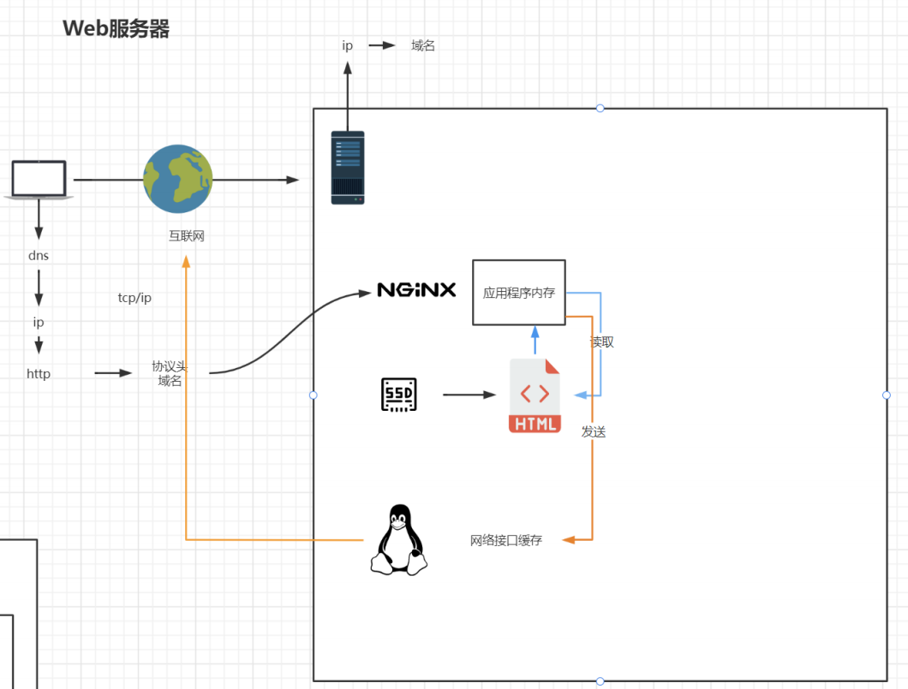

# 第1章 nginx的使用

## nginx的目录结构

- client_body_temp
- conf
- - fastcgi.conf
  - fastcgi.conf.default
  - fastcgi_params
  - fastcgi_params.default
  - koi-utf
  - koi-win
  - mime.types
  - mime.types.default
  - nginx.conf
  - nginx.conf.default
  - scgi_params
  - scgi_params.default
  - uwsgi_params
  - uwsgi_params.default
  - win-utf
- fastcgi_temp
- html
- logs
- proxy_temp
- sbin
- - nginx
- scgi_temp
- uwsgi_temp

## nginx配置与应用场景

nginx.conf配置文件

```coffeescript

#user  nobody;
#默认为1，表示开启一个业务进程 
worker_processes  1;

#error_log  logs/error.log;
#error_log  logs/error.log  notice;
#error_log  logs/error.log  info;

#pid        logs/nginx.pid;


events {
    #单个业务进程可接受连接数
    worker_connections  1024;
}


http {
    #引入http mime类型
    include       mime.types;
    #如果mime类型每匹配上，默认使用二进制流的方式传输
    default_type  application/octet-stream;

    #log_format  main  '$remote_addr - $remote_user [$time_local] "$request" '
    #                  '$status $body_bytes_sent "$http_referer" '
    #                  '"$http_user_agent" "$http_x_forwarded_for"';

    #access_log  logs/access.log  main;

    #使用linux的sendfile(socket,file,len)高效网络传输，也就是数据0拷贝
    sendfile        on; 
    #tcp_nopush     on;

    #keepalive_timeout  0;
    keepalive_timeout  65;

    #gzip  on;

    server {
        listen       80; #监听端口号
        server_name  localhost; #主机名

        #charset koi8-r;

        #access_log  logs/host.access.log  main;

        location / { #匹配路径
            root   html; #文件根目录
            index  index.html index.htm; #默认页名称
        }

        #error_page  404              /404.html;

        # redirect server error pages to the static page /50x.html
        #错误码500 502 503 504返回50x.html页面
        error_page   500 502 503 504  /50x.html;
        location = /50x.html {
            root   html;
        }

        # proxy the PHP scripts to Apache listening on 127.0.0.1:80
        #
        #location ~ \.php$ {
        #    proxy_pass   http://127.0.0.1;
        #}

        # pass the PHP scripts to FastCGI server listening on 127.0.0.1:9000
        #
        #location ~ \.php$ {
        #    root           html;
        #    fastcgi_pass   127.0.0.1:9000;
        #    fastcgi_index  index.php;
        #    fastcgi_param  SCRIPT_FILENAME  /scripts$fastcgi_script_name;
        #    include        fastcgi_params;
        #}

        # deny access to .htaccess files, if Apache's document root
        # concurs with nginx's one
        #
        #location ~ /\.ht {
        #    deny  all;
        #}
    }


    # another virtual host using mix of IP-, name-, and port-based configuration
    #
    #server {
    #    listen       8000;
    #    listen       somename:8080;
    #    server_name  somename  alias  another.alias;

    #    location / {
    #        root   html;
    #        index  index.html index.htm;
    #    }
    #}


    # HTTPS server
    #
    #server {
    #    listen       443 ssl;
    #    server_name  localhost;

    #    ssl_certificate      cert.pem;
    #    ssl_certificate_key  cert.key;

    #    ssl_session_cache    shared:SSL:1m;
    #    ssl_session_timeout  5m;

    #    ssl_ciphers  HIGH:!aNULL:!MD5;
    #    ssl_prefer_server_ciphers  on;

    #    location / {
    #        root   html;
    #        index  index.html index.htm;
    #    }
    #}

}

```

### sendfile配置

未开启时，需要拷贝文件



开启后


### server配置

**1、修改本地hosts文件** 

```properties
47.103.96.17 llf.nginxa.com
47.103.96.17 www.nginxa.com
```

**服务器创建index.html**

```
mkdir /www/www
mkdir /www/vod

vim /www/www/index.html
vim /www/vod/index.html
```

**修改nginx.conf配置**

1. 不同端口

```coffeescript
    server {
        listen       81;
        server_name  nginxa.com;

        #charset koi8-r;

        #access_log  logs/host.access.log  main;

        location / {
            root   /www/www;
            index  index.html index.htm;
        }

        #error_page  404              /404.html;

        # redirect server error pages to the static page /50x.html
        #
        error_page   500 502 503 504  /50x.html;
        location = /50x.html {
            root   html;
        }
    }

    server {
        listen       82;
        server_name  llf.nginxa.com;

        #charset koi8-r;

        #access_log  logs/host.access.log  main;

        location / {
            root   /www/vod;
            index  index.html index.htm;
        }

        #error_page  404              /404.html;

        # redirect server error pages to the static page /50x.html
        #
        error_page   500 502 503 504  /50x.html;
        location = /50x.html {
            root   html;
        }
    }
```

2. 相同端口

```coffeescript
1、完整匹配
	server_name  llf.nginxa.com;

2、通配符匹配
	server_name  *.nginxa.com;

3、通配符结束匹配
	server_name  llf.*;

4、正则匹配
	server_name ~^[0-9]+\.nginxa\.com$;
```

